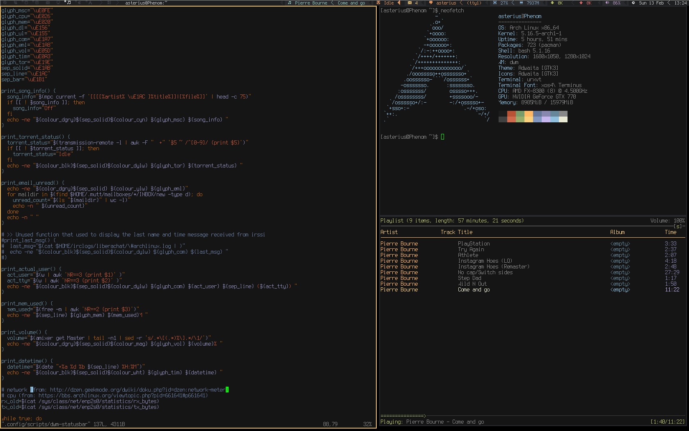

# Description
Custom adaptation of w0ng's original configuration from 2010. dwm v6.2. Tuned for Arch Linux.

# Branches and patches
The master branch is the stable and working build configuration, and the development branch is only for test purposes (you can use it, but it isn't recommended since I update it regularly to test things). Color codes are from [StatusColors Patch](https://dwm.suckless.org/patches/statuscolors/) and I fixed the statusbar gap problem applying a patch manually. It's pretty much the raw DWM experience but with some minor tweaks for the custom configuration. My statusbar is linked [here](https://github.com/asterius09/dotfiles), will work out of the box with this DWM as it uses xsetroot to execute it. 

# Prerequisites 
Font used is [Terminus](https://sourceforge.net/projects/terminus-font/files/terminus-font-4.49/terminus-font-4.49.1.tar.gz/download) and [Siji](https://github.com/stark/siji) (for the glyphs). You'll need also the basic Xorg packages in order for DWM to work on your distro (xorg-xsetroot is necessary if you want to apply a statusbar). Some keybindings are set to scrot (screenshots) and mpd (music) services so you'll need those also. 

# Installation process
Process is simple, you only have to git clone the stable repository and compile it from source:
```sh
git clone https://github.com/asterius09/dwm
```
Then, compile it with administrator rights:
```sh 
sudo make clean install
```

# Manual configuration process
If you want to manually apply patches or custom configurations, follow these steps:

  1. Modify config.def.h / dwm.c at your liking.
  2. Save all the files and delete config.h if it's present (or config.def.h will be ommited while compiling).
  3. Compile it from source.

This way you'll apply updates safely without errors or wrong files at patching. If you want to keep the original compiled revision of config.def.h, you can edit config.h as it will be the default configuration file when compiling.

# Screenshots

